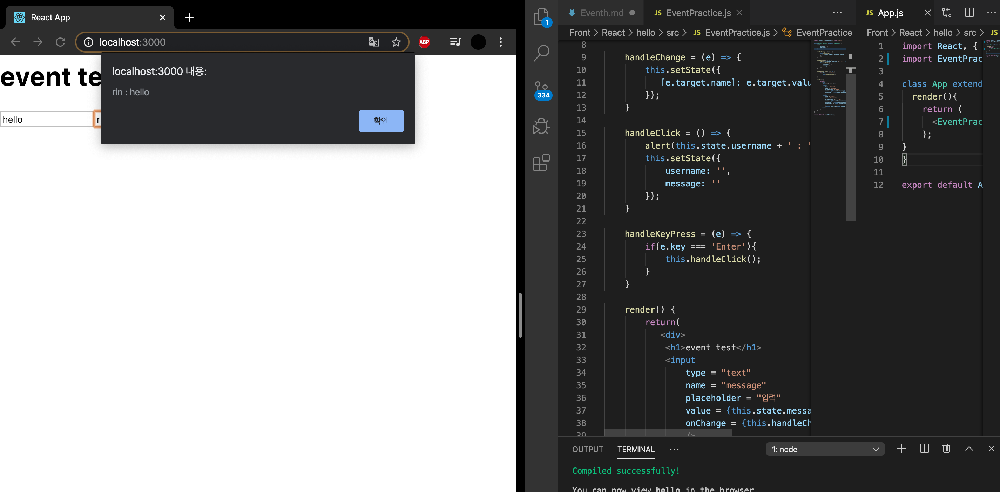

사용자가 웹에 DOM 요소들과 상호 작용하는 것을 이벤트라고 한다. ex) 버튼에 커서를 올렸을 땐 onmouseover를 실행, 클릭했을 땐 onClick 실행. 

## Event system (React)
- 이벤트를 사용할 때 주의 사항 
 1. 이벤트 이름은 camelCase로 작성. ex) HTML의 onclick은 리액트에서 onClick, onkeyup은 onKeyUp.
 
 2. 이벤트에서 실행할 자바스크립트 코드를 전달하는 것이 아니라, 함수 형태의 값을 전달. 

 3. DOM 요소에만 이벤트를 설정할 수 있다. 

- 이벤트 종류 
 Clipboard, Composition, Form Mouse Keyboard  Selection, Focus, Touch, UI, Image, Wheel, Animation, Media, Transition...

 ## 예제로 익히기 

- 컴포넌트 생성 -> onChange 이벤트 핸들링  -> 임의 메서드 만들기 -> input 여러 개를 핸들링 
 

 