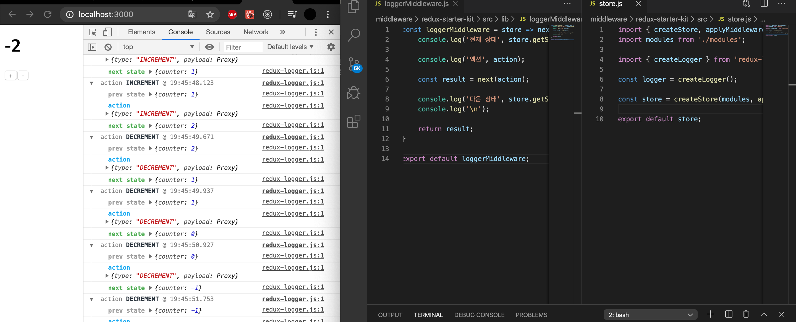
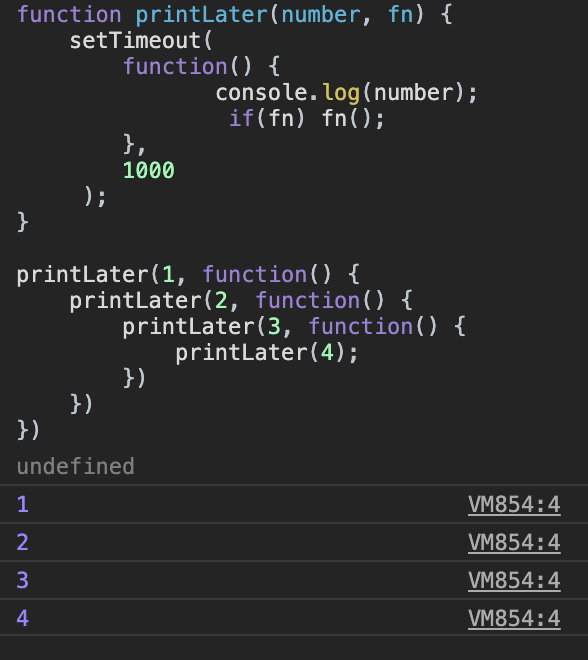
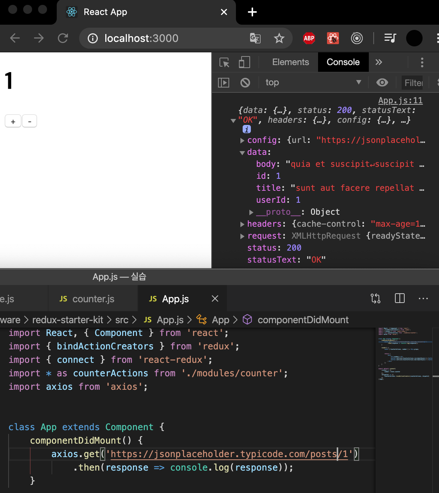

## 미들웨어 
액션을 디스패치 했을 때 리듀서에서 이를 처리하기 전에 사전에 지정된 작업들을 실행. 액션과 리듀서 사이의 중간자. 
리듀서가 액션을 처리하기 전에 미들웨어가 할 수 있는 작업은 다양하다. 단순히 전달 받은 액션을 콘솔에 기록할 수도 있고, 전달받은 액션 정보를 기반으로 액션을 아예 취소해 버리거나 다른 종류의 액션을 추가로 디스패치할 수도 있다. 


### 생성 



## 비동기 작업을 처리하는 미들웨어 사용 

### redux-thunk
thunk는 특정 작업을 나중에 할 수 있도록 미루려고 함수 형태로 감싼 것을 의미. 
```JS
//1 + 2를 연산하고 싶다면 이렇게 입력할 것이다
const x = 1 + 2;

//하지만 이렇게 하면 1+2 연산을 코드가 실행될 때 바로 하지 않고 나중에 foo 함수를 호출할 때 실행된다. 
const foo = () => 1 + 2;

```


redux-thunk <- 이 미들웨어는 객체가 아닌 함수도 디스패치할 수 있게 함으로써 일반 액션 객체로는 할 수 없는 것들도 할 수 있게 한다. 
```JS 
function incrementIfOdd() {
    return (dispatch, getState) => {
        const { counter } = getState();

        if(counter % 2 === 0) {
            return;
        }

        dispatch(increment());
    };
}

```
리턴하는 함수에서 dispatch, getState를 파라미터로 받게 한다면 스토어 상태에도 접근 가능. 객체가 아니라 이렇게 함수를 반환하는 함수는 thunk 생성 함수라고 한다. thunk 생성 함수에서는 dispatch와 getState를 파라미터로 가지는 새로운 함수를 만들어서 반환해야 한다. 네트워크 요청을 해도 되며, 이 안에서 또 다른 종류의 액션들을 여러번 디스패치 할 수도 있다. 


### 웹 요청 처리 

#### Promise란?
ES6 문법에서 비동기 처리를 다루는 데 사용하는 객체 


이렇게 비동기적으로 해야할 작업이 많으면 코드 구조는 자연스레 깊어질 것이고 그렇게 되면 코드를 읽기 힘들다. 기본 자바스크립트의 이런 문제를 해결해 주는 것이 바로 Promise. 

앞 코드를 Promise로 작성하면 아래와 같다. (결과는 동일)

.png)

printLater를 몇번 하든 코드 깊이는 일정. Promise는 값을 리턴하거나 오류를 발생시킬 수도 있다. 

- Promise에서 결과 값을 반환할 때는 resolve (결과 값)을 작성하고 오류를 발생시킬 때는 reject(오류)를 작성. 여기서 반환하는 결과 값과 오류는 .then 또는 .catch에 전달하는 함수의 파라미터로 설정. 

#### axios 사용

axios로 웹 요청을 했을 때 반환되는 객체는 해당 요청의 응답 정보를 지닌 객체. data 부분을 보면 API에서 응답한 내용이 들어있다. 

- 리덕스에서 비동기 작업을 처리하는 방법은 redux-thunk 외에도 다양하게 있다. 예를 들어 redux-promise-middleware, redux-saga, redux-pender, redux-observable 등


### redux-promise-middleware 
redux-promise-middleware는 Promise 기반의 비동기 작업을 좀 더 편하게 해 주는 미들웨어. Promise 객체를 payload로 전달하면 요청을 시작, 성공, 실패할 때 액션의 뒷부분에 _PENDING, _FULFILLED, _REJECTED를 붙여서 반환. 그래서 각 액션 타입을 일일이 선언할 필요가 없다.  

- 웹 요청을 할 때, 가장 신경 쓰는 부분은 해당 요청 결과가 어떻고, 그에 대해서 어떻게 상태 업데이트를 할지이다. 해당 요청이 현재 진행 중인지, 오류가 발생했는지 매번 관리해줘야 한다. 


### redux-pender
redux-pender는 Promise 기반 액션들을 관리하는 미들웨어가 포함되어 있는 라이브러리. 작동 방식은  redux-promise-middleware와 유사. 추가로 요청을 관리하는 리듀서가 포함되어 있으며, 요청 관련 액션들을 처리하는 액션 핸들러 함수들을 자동으로 만드는 도구도 들어있다. 
