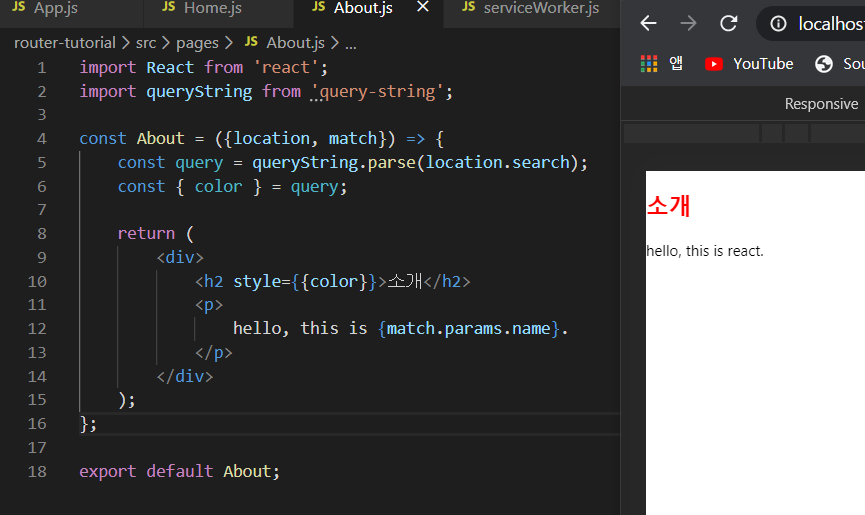
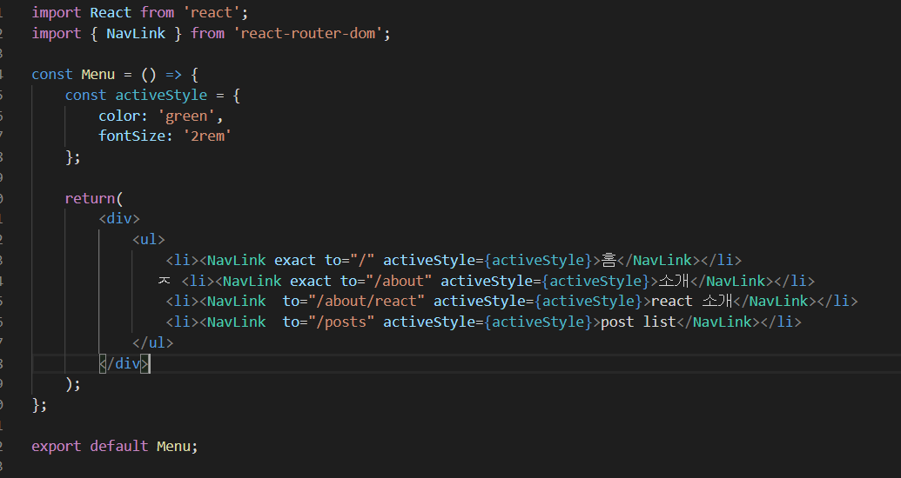
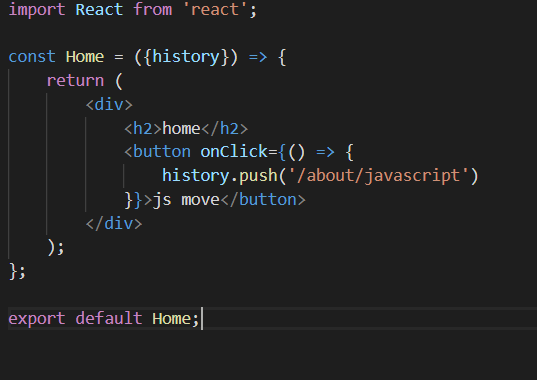
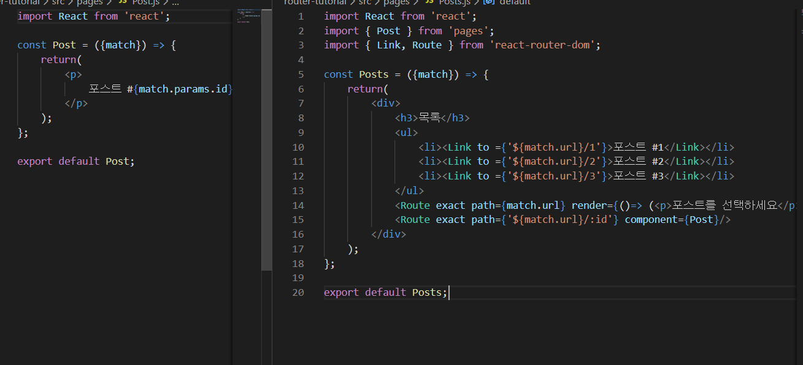

SPA란, 싱글 페이지 애플리케이션의 약자로 페이지가 한 개인 애플리케이션이라는 의미. 

- SPA 단점은 앱 규모가 커지면 자스 파일 크기도 너무 커진다는 것. 페이지를 로딩할 때, 유저가 실제로 방문하지 않을 수도 있는 페이지와 관련된 컴포넌트 코드도 같이 불러오기 때문. 


## 프로젝트 구성 
- react-router 라이브러리를 이용한 SPA 개발 
프로젝트 준비하기 -> 리액트 라우터 적용하기 -> 라우트 생성 및 파라미터 사용하기 -> 라우트 이동하기 -> 라우트 관련 객체 알아보기 


## Route와 파라미터 

### Query String 
URL 뒤에 /about/something?key=value&anotherKey=value 형식으로 들어가는 정보.
라우트 내부에서 정의한다. 




## 라우트 이동 

### Link 컴포넌트
다른 라우트로 이동할 때는, 다른 페이지로 이동하는 링크를 작성할 때 사용하는 a 태그 형식으로 하게 되면 페이지를 새로고침하면서 로딩하기 때문에 이 형식으로 하면 안 된다. 

새로고침을 방지하려면 리액트 라우터에 있는 Link 컴포넌트를 사용해야한다. 페이지를 새로고침하여 불러오지 않고, 주소 창 상태를 변경하고 원하는 라우트로 화면을 전환한다. 


### NavLink 컴포넌트 
Link 컴포넌트와 비슷하지만, 현재 주소와  해당 컴포넌트의 목적지 주소가 일치한다면 특정 스타일 또는 클래스를 지정할 수 있다. 



첫 번째와 두 번째에 exact가 포함되어 있지 않다면 /about/react 페이지에 들어갈 때 / 경로와 /about 경로 둘 다 일치하는 것으로 간주하여 모든 링크에 스탕리을 적용한다. 


### 자바스크립트에서 라우팅 
링크를 클릭하는 단순한 경우가 아닌 자바스크립트에서 페이지를 이동해야 하는 로직을 작성해야 할 때도 있는데 라우트가 사용된 컴포넌트가 받아오는 pops 중 하나는 history 객체의 push 함수를 활용하면 된다. (예를 들어 로그인을 구현한다면 로그인이 성공했을 때 특정 경로로 이동 시켜 주어야 하는데 Link 컴포넌트는 단순히 클릭했을 때 이동시키는 기능이므로 다른 방법인 push 함수를 활용.)





## 라우트 안의 라우트 



 match.url은 나중에 "/posts"라는 라우트로 등록하는데 현재 라우트에 설정된 경로 "/pos"를 알려준다. 링크의 to 값을 지정할 때 "/posts/1"로 설정해도 동일하게 작동. 차이점은 나중에 Posts 컴포넌트의 라우트 주소를 "/blog-posts"로 변경 했다고 가정했을 때, 내부 주소도 자동을 반영하기 때문에 따로 변경할 필요가 없다. 


 
 
 
 
 ## 라우트로 사용된 컴포넌트가 전달받는 props 
### location 
- 현재 페이지의 주소 상태를 알려준다. Post 페이지 컴포넌트에서 location을 조회하면 다음 결과가 나온다 

```JS 
{
    "pathname": "/posts/3"
    "search": "",
    "hash": "",
    "key": "xmsczi"
}
```


### match 
- <Route> 컴포넌트에서 설정한 path와 관련된 데이터를 조회할 때 사용. 현재 URL이 같을지라도 다른 라우트에서 사용된 match는 다른 정보를 알려준다. 주로 params 를 조회하거나 서브 라우트를 만들 때 현재 path를 참조하는데 사용.


### history 
- 현재 라우트를 조작할 때 사용. 뒤쪽 페이지로 넘어가거나 다시 앞 페이지로 가거나 새로운 주소로 이동해야 할 대 history 객체가 지닌 함수들을 호출. 


## withRouter로 기타 컴포넌트에서 라우터 접근 
앞에서 쓴 세가지 props는 라우트로 사용된 컴포넌트에서만 접근할 수 있었다. 즉, 라우트 내부 또는 외부 컴포넌트에서는 history, location, match 등 값을 사용할 수 없습니다. 예를 들어 Menu 컴포넌트는 라우트 외부에 있기 때문에 이 세가지를 사용할 수 없다. 

- withRouter를 사용하여 해당 props에 접근할 수 있다. 

```JS
import { NavLink, withRouter } from 'react-router-dom';
(...)
export default withRouter(Menu);
```
위와 같이 컴포넌트 위쪽에서 witchRouter를 리액트 라우터에서 불러온 후, 내보낼 때 감싸주면 Menu 컴포넌트에서도 history 등 객체를 사용할 수 있다. 


# 정리 
큰 규모의 프로젝트를 진행하다 보면 웹 브라우저에서 사용할 컴포넌트, 상태 관리를 하는 로직들, 여러 기능을 구현하는 함수들이 점점 쌓이면서 컴포넌트 코드를 많이 입력하기 때문에 최종 결과물인 자바스크립트 파일 크기가 매우 커진다는 문제가 발생한다. 

예를 들어 위에서 반든 프로젝트에서는 사용자가 /about 페이지로 들어왔음에도 당장 필요하지 않은 Post 관련 페이지 컴포넌트 정보도 함께 불러온다. 

이러한 단점을 보완해 주는 코드 스플리팅이 있다 (no.17)