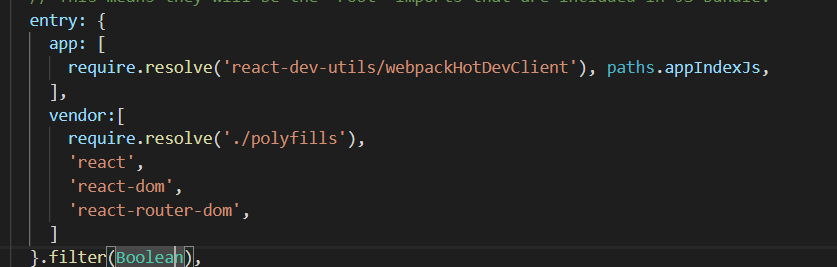
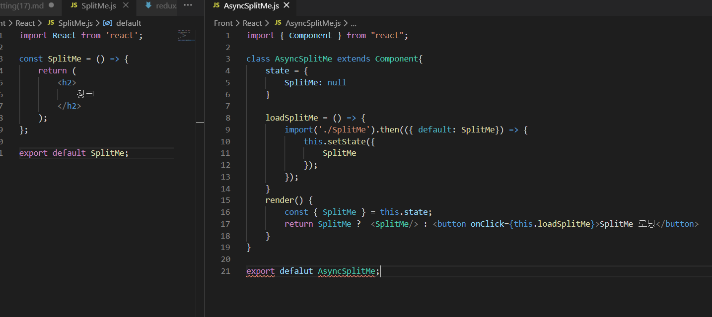

- 코드 스플리팅은 코드를 분할한다는 의미. webpack에서 프로젝트를 번들링할 때 하일 하나가 아니라 파일 여러 개로 분리시켜서 결과물을 만들 수있고 페이지를 로딩할 때 한꺼번에 불러오는 것이 아니라 필요한 시점에 불러올 수도 있다. 

## 기본 

### webpack 설정 꺼내기 

- 코드 스플리팅을 구현하려면 webpakc 설정 파일을 꺼내야 한다 (yarn eject)

### vendor 설정 
- 프로젝트에서 전역적으로 사용하는 라이브러리들을 다른 파일로 분리. 

예를 들어 react, react-dom, redux, react-redux, styled-coponents 등의 라이브러리처럼 모든 곳에서 필요하고 함께 사용하는 코드들을 따로 분리. 

주로 서드파티 라이브러리들을 vendor로 따로 분리. (프로젝트를 업데이트 할 때, 업데이트하는 파일 크기를 최소화할 수 있다.)

entry 내용을 객체로 변형하여 전역적으로 사용하는 라이브러리는 vendor 키를 가진 배열에 넣음. polyfill은 구형 웹 브라우저에서도 Promise등 ES6 전용 코드를 제대로 작동할 수 있게 해 주는 라이브러리. 

## 청크 생성 (비동기적 코드 불러오기)

vendor 처리는 단순히 원활하게 캐싱을 할 수 있게 하는 작업일 뿐 로딩할 때 모든 코드를 불러오는 것은 동일. 페이지에서 필요한 코드만 불러올면 청크를 생성해야 한다. 

## 정리 
코드 스플리팅은 프로젝트 규모가 클수록 빛을 발한다. 소규모 프로젝트라면 코드 스플리팅은 생략해도 되지만 큰 프로젝트를 할 때 필요하다 (용량을 줄여주기 때문에)