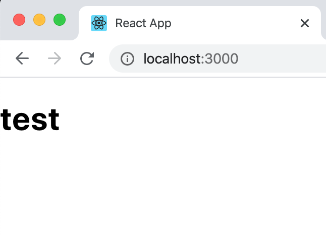
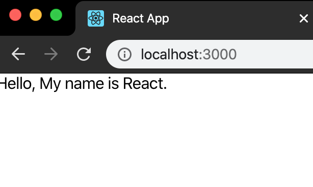

## 생성 

- 초기 코드 작성 
```JS
import React, { Component } from 'react';

class MyComponent extends Component {
    render() {
        return (
            <div>
                test
            </div>
        )
    }
 }

 export default MyComponent;
 ```


 - 모듈 내보내기 (export)
 컴포넌트에서 맨 아래쪽 코드는 다른 파일에서 이 파일을 import할 때, 위쪽에서 선언한 MyComponent 클래스를 불러오도록 설정 


 - 모듈 불러오기 
  App component에서 MyComponent 컴포넌트를 불러와 사용. 


```JS
import React, { Component } from 'react';
import MyComponent from './MyComponent'; //MyComponent 파일을 불러옴.

class App extends Component {
  render(){
    return (
      <MyComponent/>
    );
}
}

export default App;
```




## props
 props는 properties를 줄인 표현으로 컴포넌트 속성을 설정할 때 사용하는 요소. props은 해당 컴포넌트를 불러와 사용하는 부모 컴포넌트에서만 설정할 수 있다. 


- JSX 내부에서 props 렌더링 
```JS
.
.
.
return (
    <div>
    hello, my name is {this.props.name}.
</div>
);
.
.
```
props에 접근할 때는 이렇게 this 키워드를 사용하여 접근. 


- 컴포넌트 사용할 때 props 값 설정
```JS
.
.
return (
    <MyComponent name="React"/>
);
.
.
```




- props 기본 값 설정: defalutProps 

```JS
.
.
class MyComponent extends Component {
    static defaultProps = {
        name: '기본 이름'
    }
    render(){
        return (
            <div>
            my name is {this.props.name}입니다. 
            </div>
        );
    }
}
```


- props 검증: propTypes 
 컴포넌트의 필수 props를 지정하거나 props 타입을 지정할 때는 propTypes를 사용합니다. 컴포넌트의 propTypes를 지정하는 방법은 defaultProps를 설정하는 것과 비슷. propTypes를 사용하려면 우선 코드 위쪽에 propTypes를 불러와야 한다. 

 ```JS
 import PropTypes from 'prop-types';
 ```

 클래스 밖에서 설정해도 된다. 
    

    - propTypes 종류 
     : array - 배열
     : bool - 참, 거짓
     : func - 함수 
     : number - 숫자 
     : object - 객체 
     : string - 문자열 
     : symbol - ES6 문법의 심벌 개체 
     : node - 렌더링할 수 있는 모든 것 
     : element - 리액트 요소 
     : instanceOf(MyClass) - 특정 클래스의 인스턴스 
     : oneOf(['Male', 'Famale')] - 주어진 배열 요소 중 값 하나 


## state 

 컴포넌트 내부에서 읽고 또 업데이트할 수 있는 값을 사용하려면 state를 써야 한다. 언제나 기본 값을 미리 설정해야 사용할 수 있으며, this.setState() 메서드로만 값을 업데이트해야 한다.


 - 컴포넌트의 생성자 메서드: constructor()
  state 초깃값은 컴포넌트의 생성자 메서드인 constructor 내부에서 설정. 
  ```JS
  class MyComponent extends Component {
      (...)
      constructor(props){
          super(props);
      }
      render() {
          (...)
      }
  }

  export defalut MyComponent;
  ``` 


- state 초깃값 설정

```JS
constructor(props) {
    super(props);
    this.state = {
        number: 0
    }
}
```


- JSX 내부에서 state 렌더링
 props를 렌더링 하는 방법과 비슷 
 ```JS
  render(){
      return (
          <div>
            <p>안녕하세요, 제 이름은 {this.props.name} 입니다. </p>
            <p>저는 {this.props.age}살입니다. </p>
            <p>숫자: {this.state.number} 입니다. </p>
      )
  }
 ```


 - state 값 업데이트: setState()
 state 값을 업데이트할 때는 this.setState() 메서드를 사용. 

 this.setState({
     수정할 필드 이름: 값, 
     수정할 또 다른 필드 이름: 값
 });


```JS
(...)
    render() {
        return (
            <div>
            <p>Hello, My name is {this.props.name}.</p>
            <p>I'm {this.props.age} years old.</p>
            <p>Number : {this.state.number}</p>
            <button onClick = {() => {
                this.setState({
                    number: this.state.number + 1
                })
            }}>Plus</button>
            </div>
        );
    }
```

this.setState() 메서드를 실행하는 함수가 버튼을 누를 때 실행되도록 설정. 함수를 만들 때는 ES6 문법인 화살표 함수를 사용. 


- state를 constructor에서 꺼내기 
defaultProps와 propTypes를 정의할 때 사용한 transform-class-properties 문법으로 바깥에서 정의할 수 있다. 


```JS
 constructor(props){
        super(props); 
        this.state = {
            number: 0
        }
    }
 
 //위에 코드를 

 state = {
     number: 0
 }
  render () {
      (...)
  } //이렇게 꺼낼 수 있다. 

```


- state 값을 업데이트할 때 주의 사항 
 state 값을 업데이트 할 때는 언제나 setState로만 업데이트 해야 한다. (자세한 건 8장에서)

 
