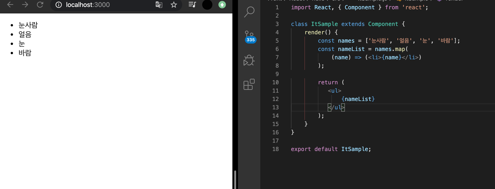

## 자바스크립트 배열의 map() 함수


#### 문법 
 arr.map(callback, [thisArg])

 - callback : 새로운 배열의 요소를 생성하는 함수로 파라미터는 다음 세가지. 
 - currentValue : 현재 처리하고 있는 요소 
 - index : 현재 처리하고 있는 요소의 index의 값
 - array : 현재 처리하고 있는 원본 배열 

- thisArg(선택) : callback 함수 내부에서 사용할 this 레퍼런스 


#### 예제
map 함수를 사용하여 배열 [1,2,3,4,5]의 각 요소를 제곱하여 새로운 배열을 생성 


```JS
let numbers = [1,2,3,4,5];

let processed = numbers.map(function(num){
    return num * num;
});

console.log(processed);
```


## 데이터 배열을 컴포넌트 배열로 map 하기 

#### 예제 




## key 

#### key 설정 
 key 값을 설정할 때는 map 함수의 인자로 전달되는 함수 내부에서 컴포넌트 props를 설정하듯이 설정하면 된다. 

 ```JS
 const names = ['눈사람', '얼음', '눈', '바람'];
        const nameList = names.map(
            (name, index) => (<li key={index}>{name}</li>)
        );
 ```


### 정리
  컴포넌트 배열을 렌더링 할 때는 key 값 설정에 항상 주의해야 한다. key 값은 언제나 유일해야 하고 값이 중복된다면 렌더링 과정에서 오류가 발생한다. 상태 안에서 배열을 변형할 때는 배열에 직접 접근하여 수정하는 것이 아니라 concat, slice, 전개 연산자, filter 함수 등을 사용해서 새로운 배열을 만든 후, setState 메서드로 적용한다는 점. 