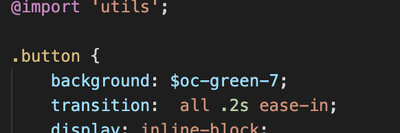

- CSS Module : 모듈화된 CSS로 CSS 클래스를 만들면 자동으로 고유한 클래스 네임을 생성하여 스코프를 지역적으로 제한하는 방식 
- Sass : 자주 사용하는 CSS 전처리기 중 하나이며, 확장된 CSS 문법을 사용하여 CSS 코드를 더욱 쉽게 작성하는 방식. 
- styled-components : JS 코드 내부에서 스타일을 정의. 


### 컴포넌트 스타일링 방법 

CSS Module 사용하기  ->  Sass 사용하기  ->  Sass 활용법 알아보기  ->  styled-components 사용하기 


## CSS Module 
CSS Module은 CSS를 모듈화 하여 사용하는 방식. CSS 클래스를 만들면 자동으로 고유한 클래스네임을 생성하여 스코프를 지역적으로 제한. 모듈화 된 CSS를 webpack으로 불러오면 다음과 같이 사용자가 정의한 클래스 네임과 고유화된 클래스 네임으로 구성된 객체를 반환. 

업데이트 된 CA 덕분에 책과 다르게 module를 활성화 할 필요 없다. yarn eject를 한 후에 App.css -> App.module.css로 변경하고 App.js에 적용해 주면 활성화가 된다. 


예)


### 클래스가 여러 개일 때
 classnames 라이브러리를 사용. 
```JS
(...)
 return(
      <div className={classNames(Styless.box, Styless.blue)}>
          
      </div>
    );
```

classNames(클래스 이름, 또 다른 클래스 이름) 방식으로 호출하면 자동으로 사이에 공백을 넣어준다. classNaems의 bind 기능을 사용하면 styles.를 생략할 수 있다. 


### classNaems 사용 예제 
classNames('foo', 'bar');  => 'foo bar'
classNames('foo', { bar: true });  => 'foo bar'
classNames({  'foo-bar': true  });  => 'foo bar'
classNames({  'foo-bar': false  });  => ''
classNames({ foo: true }, { bar : true });  => 'foo bar'
classNames({ foo: true, bar : true });  => 'foo bar'
classNames(['foo', 'bar']);  => 'foo bar'


## Sass 
Sass는 Syntactically awesome style sheets의 약어로 문법적으로 매우 멋진 스타일 시트를 의미. Sass로는 Css에서 사용할 수 있는 문법을 확장하여 중복되는 코드를 줄여 더욱 보기 좋게 작성할 수 있다. 참고 : https://sass-guidelin.es/ko/ 


### Sass 사용 
- 현재 선택자 참조 

```Css
.box:hover {
  background: red;
}

.box:active {
  background: yellow;
}
```

같은 내용을 Sass의 현재 선택자 참조 기능으로 작성. & 문자를 사용.
```Scss
.box{
  &:hover {
    background: red;
  }
  &:active {
    background: yellow;
  }
}
```


- 변수, 믹스인 사용 


- Sass 라이브러리 
Sass는 스타일 관련 라이브러리를 쉽게 불러와 사용할 수 있다는 장점이 있다. include-media 믹스인 라이브러리는 반응형 디자인을 도와주고, open-color에는 여러 가지 색상이 들어있다. 


비구조화 할당 문법에서 ...foo 형식으로 입력하면 비구조화 할당을 할 때 따로 지정하지 않은 것들은 모두 foo 객체에 담긴다. 

```JS
const object = {
  a: 1, 
  b: 2,
  c: 3
};

const {a, ...foo} = object;

console.log(a); // 1
console.log(foo) // { b: 2, c: 3 }
```




open-color를 적용하면 변수를 사용하여 여라 가지 색상을 쉽게 적용 가능. 변수 형식은 '$oc-색상 이름-명암'. 


include-media는 믹스인으로 구성된 라이브러리. 사용할 때는 이전에 설정한 breakpoints에서 지정한 값을 참조하여 @include media ('<huge') {...} 형식으로 작성. 
```Scss

    //반응형
    @include media ("<huge"){
        width: 1024px;
    }

    @include media ("<large"){
        width: 768px;
    }

    @include media ("<medium"){
        width: 90%;
    }


```


## styled-components 
styled-components를 불러온 후 styled를 사용하여 Wrapper 값에 스타일링 된 div 요소를 만들었다. 

 


이것은 ES6의 Tagged Template Literals 문법이다. 


styled-components의 최대 장점은 자바스크립트 내부에서 스타일을 정의하기 때문에 자바스크립트와 스타일 사이의 벽이 허물어져 동적 스타일링이 더욱 편해진다는 것. 


참고: https://wwww.styled-components.com/

