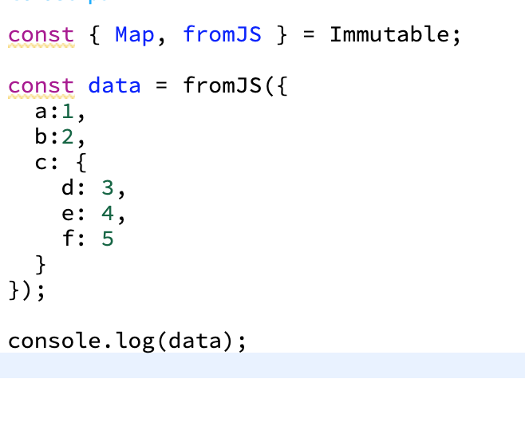

## Immutable.js
- 자바스크립트에서 불변성 데이터를 다룰 수 있도록 도와준다 


### 객체 불변성 
```JS
let a = 7; 
let b = 7; 

let object = { a: 1, b: 2};
let object = { a: 1, b: 2};

-> a === b //true
-> object1 === object2 //false 
```
a, b 값은 같지만 object1, object2가 가진 값이 같더라도 서로 다른 객체이기 때문에 false를 반환

```JS
let object3 = object1
-> object1 === object3 //true
```

object1과 object3은 같은 객체를 가리키기 때문에 true를 반환 

```JS
object3.c = 3;
-> object1 === object3 //true
object1 //object { a:1, b: 2, c: 3}

let array1 = [0,1,2,3,4];
let array2 = array1;
array2.push(5);

-> array1 === array2 //true
```


컴포넌트는 state 또는 상위 컴포넌트에서 전달받은 props 값이 변할 때 리렌더링 되는데, 배열이나 객체를 직접 수정한다면 내부 값을 수정했을지라도 레퍼런스가 가리키는 곳은 같기 때문에 똑같은 값으로 인식. 


### Map 
Immutable의 Map은 객체 대신 사용하는 데이터 구조. 자바스크립트 내에 Map과는 다륾.




해당 데이터를 실제로 활용하거나 업데이트를 해야할 때는 내장 함수를 사용. 
ex) data 내부의 a 값을 참조하고 싶다면 data.a로 작성하는 것이 아니라 data.get('a')를 해야한다. 


##### 자바스크립트 객체로 변환 
```JS
const deserialized = data.toJS();
console.log(deserialized);
//{ a:1, b:2, c:{ d:3, e:4} }
```


##### 특정 키의 값 불러오기 
```JS
data.get('a'); //1
```


##### 깊숙이 위치하는 값 불러오기 
Map 내부에 또 Map이 존재하고, 그 Map 안에 있는 키 값을 불러올 때는 getIn 함수를 사용.
```JS
data.getIn(['c', 'd']); //3
```


##### 값 설정 
새 값을 설정할 때는 get 대신 set 사용 
```JS
const newData = data.set('a', 4);
```
set 한다고 해서 데이터가 실제로 변하는 것은 아니다. 주어진 변화를 적용한 새 Map를 만드는 것. 서로 다른 Map이기 때문에 false를 출력. 기존 data 값은 그대로 남아있고, 변화가 적용된 데이터를 newData에 저장하는 것. 


##### 깊숙이 위치하는 값 수정  
```JS
const newData = data.setIn(['c','d'],10);
```


##### 여러 값 동시에 설정 
```JS
const newData = data.mergeIn(['c'], { d: 10, e: 10});
```


### List 
List는 Immutable 데이터 구조로 배열 대신 사용. 배열과 동일하게 Map, filter, sort, push, pop 함수를 내장하고 있다. 

##### 생성 
List는 다음과 같이 만든다 
```JS
const { List } = Immutable;
const list = List([0, 1, 2, 3, 4]);
```

객체들의 List를 만들어야 할 때는 다음과 같이 객체들을 Map으로 만들어야 추후 get set을 사용할 수 있다. 
```JS
const { List, Map, fromJS } = Immutable;

const list = List([
    Map({ value: 1}),
    Map({ value: 2})
]);

//or

const list2 = fromJS([
    { value: 1 },
    { value: 2}
]);
```

fromJS를 사용하면 내부 배열은 List로 만들고, 내부 객체는 Map으로 만든다.
 Map과 마찬가지로 List도 toJS를 사용하여 일반 배열로 변환할 수 있다.
```JS
console.log(list.toJS(());
```


##### 값 읽어오기 
n번째 원소 값은 get(n)을 사용하여 읽어온다. 
```JS
list get(0);
```

0번째 아이템의 value 값은 다음과 같이 읽어온다. 
```JS
list.getIn([0, 'value']);
```


##### 아이템 수정 
n번째 아이템을 수정해야 할 때는 set과 setIn 원소를 통째로 바꾸고 싶을 때는 다음과 같이 set을 사용 
```JS
const newList = list.set(0, Map({value: 10}))
```
List의 Map 내부 값을 변경하고 싶을 때는 다음과 같이 setIn을 사용 
```JS
const newList = list.setIn([0, 'value'], 10);
```


##### 아이템 추가 
```JS
const newList = list.push(Map({value: 3}))

///리스트 맨 앞에 데이터를 추가하고 싶을 땐 unshift

const newList = list.unshihft(Map({value: 0}));
```


##### 아이템 제거 
```JS 
const newList = list.delete();
```


##### list 크기 가져오기 
```JS
console.log(list.size);
```


### Ducks 파일 구조 
리덕스에서 사용하는 파일들은 액션 타입, 액션 생성 함수, 리듀서로 분리하여 관리한다.  몇몇 개발자들이 귀찮고 번거로운 작업이라 생각해서 이 세가지를 한 파일에 모듈화하여 관리하는 Ducks 파일 구조를 개발한 것이다. 


#### 예시 
```JS
//액션 타입
const CREATE = 'my-app/todos/CREATE';
const REMOVE = 'my-app/todos/REMOVE';
const TOGGLE = 'my-app/todos/TOGGLE';

//액션 생성 함수 
export const create = (todo) => ({
    type: CREATE,
    todo,
});

export const remove = (id) => ({
    type: REMOVE,
    id
});

export const toggle = (id) => ({
    type: TOGGLE,
    id
});

const initialState = {
    //초기 상태 
}

export default function reducer(state = initialState, action) {
    switch(action.type){
        //리듀서 관련 코드
    }
}
```


#### 규칙 
- export default를 이용하여 리듀서를 내보내야 한다.
- export를 이용하여 액션 생성 함수를 내보내야 한다. 
- 외부 리듀서에서 모듈의 액션 타입이 필요할 때는 액션 타입을 내보내도 된다. 


### reudx-actions

#### createAction

[기존의 코드]
```JS
export const increment = (index) => ({
    type: types.INCREMENT,
    index
});

export const decrement = (index) => ({
    type: types.DECREMENT,
    index
});


///createAction 사용 시 
export const increment = createAction(types.INCREMENT);
export const decrement = createAction(types.DECREMENT);

//이렇게 만든 함수에 파라미터를 넣어서 호출출하면 payload 키에 파라미터로 받은 값을 넣어 객체를 만들어준다 

increment(3); 
/* -> {
     type: 'INCREMENT',
     payload: 3
 }
 */


 //파라미터가 여러 개일 때 
 export const setColor = createAction(types.SET_COLOR);

 setColor({index: 5, color: '#fff'})
 /* -> 결과 : 
 {
     type: 'SET_COLOR',
     payload: {
         index: 5, 
         color: '#fff'
     }
 }
 */
```


#### switch 대신 handleActions 사용
앞에선 switch 문을 사용하여 액션 타입에 따라 다른 작업을 하도록 했다. 하지만 scope를 리듀서 함수로 설정했다는 것이다. 그래서 서로 다른 case에서 let이나 const를 사용하여 변수를 선언하려고 할 때 같은 이름이 중첩되어 있으면 오류가 발생한다. 해결방안은 handleActions를 사용하면 된다 

```JS
const reducer = handleActions({
    INCREMENT: (state, action) => ({
        counter: state.counter + action.payload
    }),

    DECREMENT: (state, action) => ({
        counter: state.counter - action.payload
    })
}, {counter: 0});

