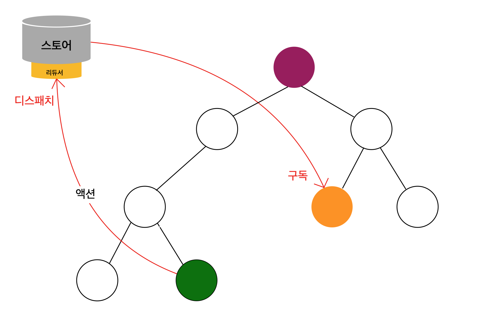
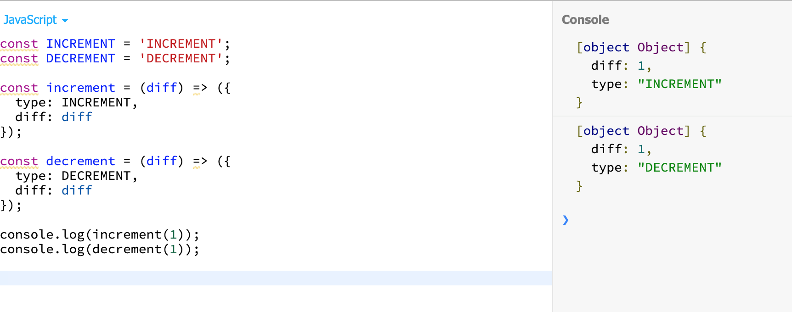

리덕스는 리액트에서 상태를 효율적으로 관리하는 데 사용하는 상태 관리 라이브러리.

## Redux 
리덕스는 상태 관리의 로직을 컴포넌트 밖에서 처리하는 것. 리덕스를 사용하면 스토어라는 객체 내부에 상태를 담게 된다. 




```
- 스토어 : 애플리케이션의 상태 값들을 내장. 
- 액션 : 상태 변화를 일으킬 때 참조하는 객체. 
- 디스패치 : 액션을 스토어에 전달하는 것을 의미
- 리듀서 : 상태를 변화 시키는 로직이 있는 함수. 
- 구독 : 스토어 값이 필요한 컴포넌트는 스토어를 구독. 
```


상태에 어떤 변화를 일으켜야 할 때는 액션이라는 것을 스토어에 전달. 액션은 객체 형태로 되어 있으며, 상태를 변화시킬 때 이 객체를 참조하여 변화를 일으킨다. 액션을 전달하는 과정은 디스패치. 스토어가 액션을 받으면 리듀서가 전달받은 액션을 기반으로 상태를 어떻게 변경시켜야 할지 정한다. 액션을 처리하면 새 상태를 스토어에 저장. 스토어 안에 있는 상태가 바뀌면 스토어를 구독하고 있는 컴포넌트에 바로 전달. 부모 컴포넌트로 props를 전달하는 작업은 생략, 리덕스에 연결하는 함수를 사용하여 컴포넌트를 스토어에 구독시킨다. 


## 사용
리덕스는 리액트에서 사용하려고 만든 거지만 리액트에 의존하지 않는다. 즉, 리액트를 사용하지 않아도 사용할 수 있다. 

* 리덕스 사용 
JSBin에서 리덕스 불러오기 -> 액션과 액션 생성 함수 알아보기 -> 초기 상태 및 리듀서 정의하기 -> subscribe와 dispatch 함수 알아보기 


### 액션과 액션 생성 함수 
액션은 스토어에서 상태 변화를 일으킬 때 참조하는 객체. 이 객체는 type 값을 반드시 가지고 있어야 한다. 해당 액션이 어떤 작업을 하는 액션인지 정의하며, 대문자와 밑줄을 조합하여 만든다.

ex)
```JS
{
    type: "INCREMEMNT"
}
```

이 액션은 상태에 있는 값의 수치를 올린다. type 값은 필수, 나머지는 선택. 
액션 형식을 모두 꿰고 있어야 하므로 불편하기 때문에 보통 액션을 만들어주는 액션 생성 함수를 사용.




### 변화를 일으키는 함수, 리듀서 
상태에 변화를 일으키는 함수인 리듀서. 파라미터 두 개를 받는데 첫 번째 파라미터는 현재 상태, 두 번째 파라미터는 액션 객체이다. 

내부에서는 switch 문을 사용하여 action.type에 따라 새로운 상태를 만들어서 반환해야 한다. 

```JS

const initialState = {
  number: 0
};

function counter(state = initialState, action) {
  switch(action.type) {
    case INCREMENT:
      return { number: state.number + action.diff };
    case  DECREMENT:
      return { number: state.number - action.diff };
    default:
      return state;
  }
}

```


함수에서 파라미터를 설정하는 부분에 state = initialState. 이는 state 값이 underfined라면 initialState를 기본 값으로 사용한다는 의미. 


### 리덕스 스토어 생성
```JS
 const { creatStore } = Redux;

const store = createStore(counter);

```

스토어를 생성할 때는 createStore 함수를 사용. 파라미터로는 리듀서 함수가 들어가고, 두 번재 파라미터를 설정하면 해당 값을 스토어의 기본 값으로 사용. 


### 구독 
리액트 컴포넌트에서 리덕스 스토어를 구독하는 작업은 나중에 리덕스의 connect 함수가 대신한다. 
리덕스 스토어를 구독한다는 것은 리덕스 스토어의 상태가 바뀔 때마다 특정 함수를 실행 시킨다는 의미. 
```JS
(...)
const unsubscribe = store.subscribe(() => {
  console.log(store.getState())
});
```

스토어를 구독할 때는 subscribe 함수를 사용하는데 이 함수는 함수 형태의 피라미터를 받습니다. 파라미터로 전달된 함수는 스토어 상태에 변화가 일어날 때마다 호출. 나중에 구독을 취소해야 할 때는 unsubscribe()를 입력하여 호출. 

getState 함수는 현재 스토어 상태를 반환


### dispatch로 액션 전달 
스토어에 액션을 넣을 때는 store.dispatch 함수 사용. 
```JS

store.dispatch(increment(1));
store.dispatch(decrement(5));
store.dispatch(increment(10));

```

이 액션들이 디스패치 될 때마다 방금 구독할 때 등록했던 함수를 실행


## 리덕스의 규칙

### 스토어는 단 한 개!!
스토어는 언제나 단 하나. 여러 개 생성해서 상태를 관리하면 안 된다. 대신 리듀서를 여러 개 만들어 관리할 순 있다. 

### state는 읽기 전용 
리덕스의 상태, state 값은 읽기 전용. 이 값은 절대로 직접 수정하면 안 된다. 만약 수정한다면 리덕스의 구독 함수를 제대로 실행하지 않거나 컴포넌트의 리렌더링이 되지 않을 수 있다. 

### 변화는 순수 함수로 구성
모든 변화는 순수 함수(리듀서 함수)로 구성해야 한다. 순수 함수에서 결과 값을 출력할 때는 파라미터 값에만 의존해야 하며, 같은 파라미터는 언제나 같은 결과를 출력해야 한다. 예를 들어 리듀서 함수 내부에서 외부 네트워크와 데이터베이스에 직접 접근하면 안 된다. (요청이 실패할 수도 있고, 외부 서버의 반환 값이 변할 수 있기 때문)