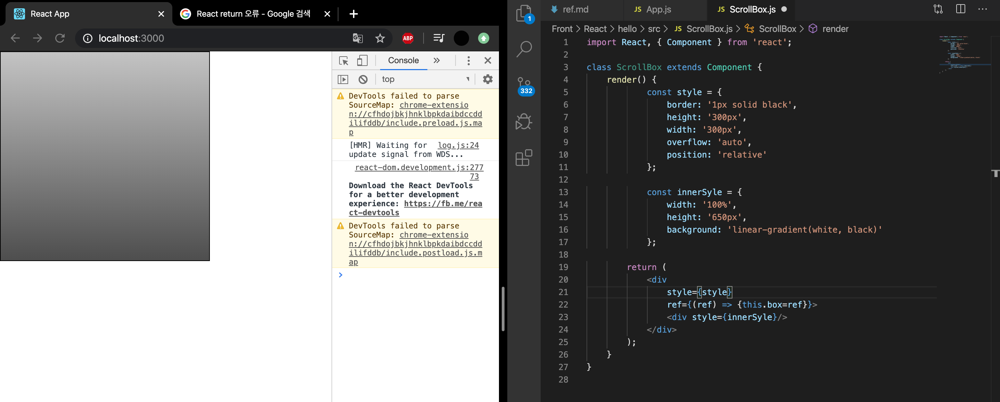

```JS
(...)
ReactDOM.render(<App />), document.getElementById('root');
```

이렇게 HTML에서 id를 사용하여 DOM에 이름을 다는 것처럼 리액트 프로젝트 내부에서 DOM에 이름을 다는 방법이 있다. ref(reference의 줄임) 개념.

ref는 DOM를 꼭 직접적으로 건드려야 할 때 사용한다. 


### DOM를 꼭 사용해야 하는 상황 
- 특정 input에 포커스 주기 
- 스크롤 박스 조작하기 
- Canvas 요소에 그림 그리기 등 

이럴 때 ref를 사용. 


## 사용법 

ref를 달아야 하는 DOM에 ref 속성을 추가할 때는 props를 설정하듯이. ref 값으로는 콜백 함수를 전달. 콜백 함수는 ref를 파라미터로 가지며, 콜백 함수 내부에서 컴포넌트의 멤버 변수에 ref를 담는 코드를 작성. 


<input ref={(ref) => {this.input=ref}}></input>


this.input은 input 요소의 DOM을 가리킨다. 


### 컴포넌트에 ref 달기 





